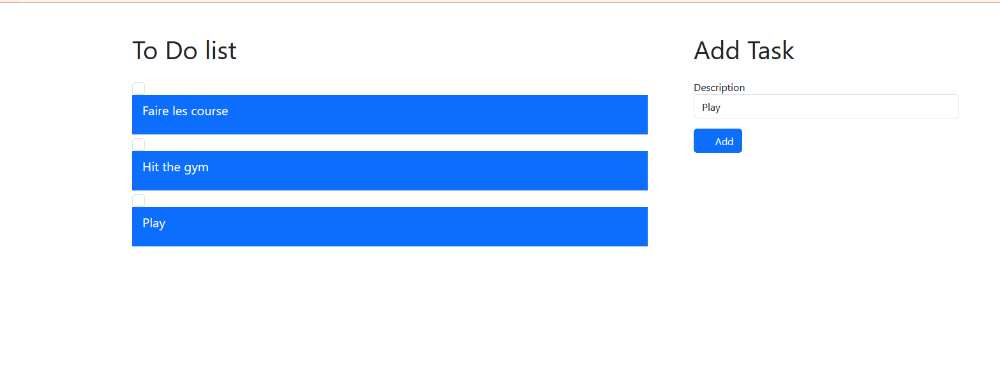

# HTMX Go Todo List

This is a simple to-do list application built with Go and HTMX.
## Features

- Add tasks
- Mark tasks as complete

## Getting Started

```bash
go run main.go
```

## Screenshot

